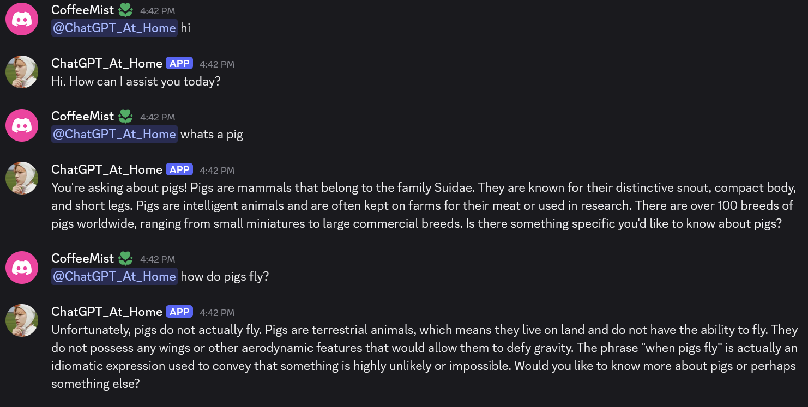
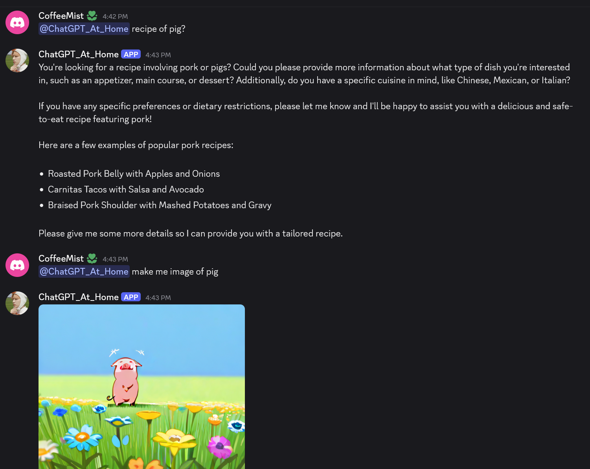
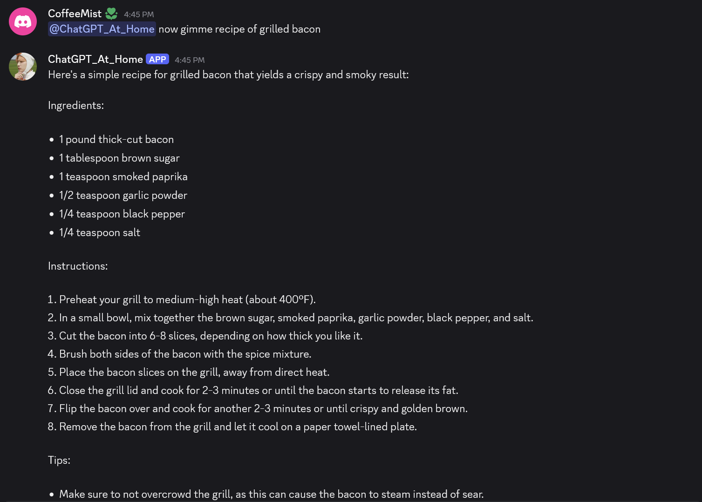

Discord Bot that can be hooked up to an LLM backend and comfyui backend to talk and generate images.

## Setup Guide:
- make a discord bot in https://discord.com/developers/applications
- add your own `config.json` with the following:

```json
{
    "koboldapp_endpoint": "ip for koboldapp server",
    "discord_token": "discord token",
    "comfy_server_address": "ip for comfyui server"
}

```
- setup `koboldapp` and `comfyui` base on instructions in their repo
    - https://github.com/comfyanonymous/ComfyUI
    - https://github.com/LostRuins/koboldcpp

## Steps To Run the Discord Bot
- run koboldapp with your preferred llm model 
- run comfyui using `python main.py` or your prefer way to launch the comfyui server
- in this repo run `python discord_bot.py` to start up the bot

## Example Demo:



